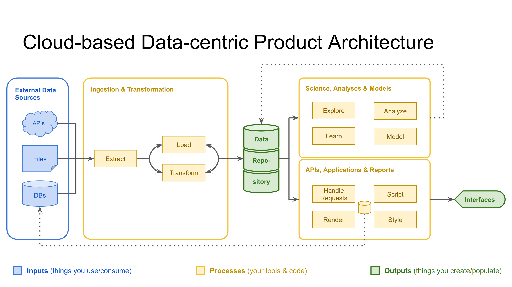

## Slides

- https://Weitzman-MUSA-GeoCloud/presentation_slides/week05/SLIDES.html
- Revisiting the data product architecture:
  

## In-class Exercise

* [BigQuery & Carto](exercises/ex_load_data_into_bigquery.md)

### Tips for the exercise...

- Be careful about the regions you choose on your GCP objects. Try to use a consistent region.
- It may be useful to know that, by default, BigQuery does not respect quoted new lines in CSV files. There is an option that you can use for `CREATE TABLE` to allow quoted new lines though: https://cloud.google.com/bigquery/docs/reference/standard-sql/data-definition-language#create_external_table_statement
- It may also be useful to know that a GeoJSON string's "validity" depends on a host of requirements that it must conform to. However, since there's so much non-conforming GeoJSON that exists, BigQuery's [`ST_GeogFromGeoJSON` function](https://cloud.google.com/bigquery/docs/reference/standard-sql/geography_functions#st_geogfromgeojson) has an optional parameter called `make_valid` that you can specify. It looks something like:
  ```sql
  SELECT ST_GeogFromGeoJSON(geog, make_valid => TRUE)
  FROM ...
  ```
  By default, the parameter is false. The function's documentation also links to a few helpful resources about GeoJSON, particularly:
  - The [Wikipedia page on GeoJSON](https://en.wikipedia.org/wiki/GeoJSON); it's a good overview
  - The [IETF standard document](https://tools.ietf.org/html/rfc7946) that defines what counts as GeoJSON-compliant


## Assignments

* [Assignment 02](https://github.com/Weitzman-MUSA-GeoCloud/assignment02)
* Read the following chapters (access book through [O'Reilly for Higher Education](http://hdl.library.upenn.edu.proxy.library.upenn.edu/1017/7026/1)):
  - For this week:
    * **Data Pipelines Pocket Reference**  
      *Chapter 1: Introduction to Data Pipelines*

    * **Data Pipelines Pocket Reference**  
      *Chapter 2: A Modern Data Infrastructure*
  
  - For next week:
    * **Data Pipelines Pocket Reference**  
      *Chapter 3: Common Data Pipeline Patterns*

    * **Designing Data-Intensive Applications**  
      *Chapter 3: Storage and Retrieval* **Only the second section (_Transaction Processing or Analytics?_) is necessary.**

      About the other _optional_ sections:  
      The first section (*Data Structures That Power Your Database*) goes in to a lot more detail about the types of indexing we were discussing this week, and the last section (*Column-Oriented Storage*) covers things we'll see in the next few weeks, but in more detail than we'll go into in class. They are optional, but feel free to read them if you enjoy technical details.

* Watch the [week 06 video](https://share.descript.com/view/Tg3BUyKVgSq)

### Tips for the assignment...

- Use SQLFluff to check your SQL syntax. You can use the `fix` subcommand to automatically fix some of the issues that SQLFluff finds. For example:
  ```bash
  sqlfluff fix my_file.sql
  ```

### Supplemental Readings

#### Loading data into BigQuery

* _BigQuery Documentation - Batch loading data_, https://cloud.google.com/bigquery/docs/batch-loading-data
* _BigQuery Documentation - Loading geospatial data_, https://cloud.google.com/bigquery/docs/geospatial-data#loading_geospatial_data
* _BigQuery Documentation - Loading Parquet data... - Geospatial data_, https://cloud.google.com/bigquery/docs/loading-data-cloud-storage-parquet#geospatial_data

#### Clustering in BigQuery

* _Introduction to clustered tables_, https://cloud.google.com/bigquery/docs/clustered-tables
* _Spatial clustering in BigQuery_, https://cloud.google.com/blog/products/data-analytics/best-practices-for-spatial-clustering-in-bigquery

#### GeoJSON

* The [Wikipedia page on GeoJSON](https://en.wikipedia.org/wiki/GeoJSON); it's a good overview
* The [IETF standard document](https://tools.ietf.org/html/rfc7946) that defines what counts as GeoJSON-compliant

#### Data Engineering

* _When to hire a data engineer?_, https://www.getdbt.com/data-teams/hiring-data-engineer
* _Engineers Should't Write ETL: A Guide to Building a High Functioning Data Science Department_, https://multithreaded.stitchfix.com/blog/2016/03/16/engineers-shouldnt-write-etl/

